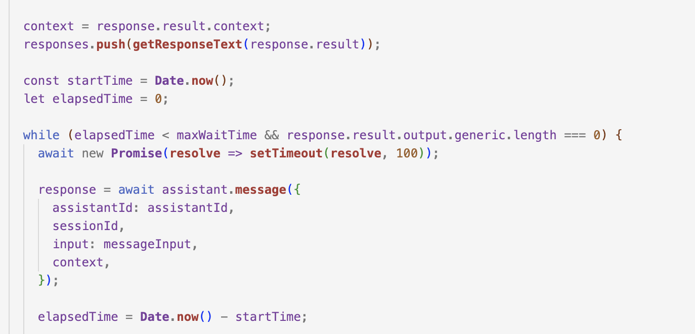
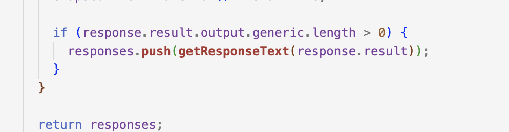

# Watson Assistant API

This API provides a service for **Watson Assistant™️** provided by **IBM**, using **Node.js**

**Watson Assistant** combines **machine learning, natural language understanding**, and **an integrated dialog editor** to create **conversation flows between your apps and your users.**

**AssistantV2 API** provides runtime methods that your client application can use to send user input to an assistant and receive a response.

You can learn more about it in IBM's [documentation](https://cloud.ibm.com/apidocs/assistant-v2?code=node).

## My Watson Assistant

I have created this **Assistant** to provide answers about certain medicines. I use **Watson Assistant**, **Watson Discovery**, and **NeuralSeek**, all available on IBM Cloud.

**Watson Assistant**: Used to build a virtual agent powered by AI.

**Watson Discovery**: Used to search and answer questions about business documents using custom NLP and Large Language Models from IBM Research.

**NeuralSeek**: Connects an existing **knowledge database**(in my case, Watson Discovery) and instantly generates **natural-language answers** to real **customer questions.**

The integration of **Watson Discovery** and **NeuralSeek** are done within **Watson Assistant.** I have [another project](https://github.com/miucciaknows/Medicine-Assistant) that demonstrates how to integrate Watson Assistant with your website, using these features.

I have used the same project to create an API connection.

### Setting up an API connection

This is my Assistant on my **IBM Cloud** Watson Assistant's instance.

--> Note that i'm using a **Plus** plan on my instance. For use an extension with [Watson Assistant](https://cloud.ibm.com/docs/assistant?topic=assistant-index), you will need a Plus instance for this.

When I made a request to **Watson Assistant** API, I faced an issue where I couldn't retrieve the text in the first request in my development environment. This is because when I send a question to Watson Assistant, it first goes to the "No action matches" node and then searches for the answer using **NeuralSeek.**

I have set up **NeuralSeek** to find the answer in my knowledge base (Watson Discovery).

To understand this better, here's an architecture diagram:

In the image above, you can see a few steps after sending the answer:

1. Extension called, returns to "No action matches".
2. Receives the answer back from Watson Assistant.

When I tried to retrieve the answer from **Watson Assistant**, all I was getting was an empty response because the "Extension called, return to **No action matches**" was the first response. To get the complete answer, I made a few adjustments to my code.

In the `assistantService.js` file, I initialized an empty object:

`let context = {};`

Then, I created `maxWaitTime` to set the time for **Watson Assistant** to provide the answer with more time. Additionally, I created an empty array to store all the answers:

`const maxWaitTime = 70000;`
 
`const responses = [];`

Following that, the code updates the conversation context with the context received from the Assistant's response and pushes the response text to the array:

`context = response.result.context;`
 
`responses.push(getResponseText(response.result));`

Next, the code records the start time and calculates the elapsed time. It then enters a loop that continues as long as the elapsed time is within the maximum wait time and the Assistant's response has no generic output.

And finally, on the last line calculates the elapsed time based on the start time and the current timestamp.

if response has any generic output messages, and if there are any, it pushes the text from those messages into an array called `responses`. And it returns the `responses` array.

And the last part of the code, it extracts the response text from the Watson Assistant `result` object. Then it iterates through the generic output messages and, if a message has a response type of 'text', it pushes the text content of that message into an array called `responseText`. Finally, returns the `responseText` array.

### To test this API on your own.

#### Requirements

- An IBM Account
- Watson Discovey instance (I'm using a plus plan) or you can store your data in IBM's COS (Cloud Object Storage)
- Watson Assistant instance (plus or above)
- NeuralSeek instance

#### Run on your localhost

I use VS Code, you can use anything you want.

1. Go to your terminal, type:

`git clone https://github.com/miucciaknows/Watson-Assistant-API`

This will create a local copy of the project on your machine.

2. Navigate to the project directory using the `cd` command. For example: `cd Watson-Assistant-API/`.

3. Install the project dependencies.

As I'm using Node.js and Express, open your terminal and then type `npm install` to install all the dependencies listed in `package.json` or `yarn add`

When the dependencies are installed, you need to start the **local server**.

Type `node index.js` or `nodemon`.

To test the can use Insomnia or anything that you want.

Get `localhost:3000/session` to create a new Session.

Post `localhost:3000/ask` to send your question, in the follow format:

{

    "question": "your input here"

}

